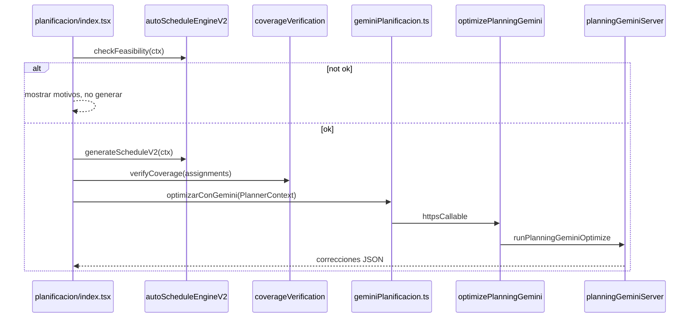

# Referencia — arquitectura planificación automática

## Diagrama



## Estados UI (autoV2)

| Estado | Significado |
|--------|-------------|
| `autoV2Report` | Informe viabilidad (`V2FeasibilityReport`) |
| `autoV2GenStats` | Métricas post-generación |
| `autoV2Coverage` | `CoverageVerificationReport` |
| `autoV2Suggestions` | Swaps heurísticos locales |
| `autoV2LastRun` | ctx + assignments para re-procesar |

## Payload Gemini (`PlannerContext`)

Campos críticos para el prompt:

- `slaVendidas`, `puestos`, `empleados`, `dias`, `diasBloqueados`
- `planificacionCompleta`, `ausencias`, `coberturaPorDia`
- `cicloCCT`, `autoCycles`

Respuesta: `GeminiRespuesta` — `correcciones[]`, `bloqueoEstructural`, `metricas`.

## Reglas Gemini (R1–R10)

Definidas en `SYSTEM_PROMPT` de `planningGeminiServer.ts`. Cualquier cambio de negocio debe reflejarse ahí y, si es estructural, en V2.

## Horas por código

| Código | h |
|--------|---|
| M, T, N | 8 |
| D12, N12 | 12 |
| F, RET, licencias | 0 (no facturable en objetivo) |

## Deploy

```powershell
$env:FUNCTIONS_DISCOVERY_TIMEOUT='120'
firebase deploy --only functions:optimizePlanningGemini
```

Rebuild functions tras cambios en `apps/functions/src/assistant/`.
