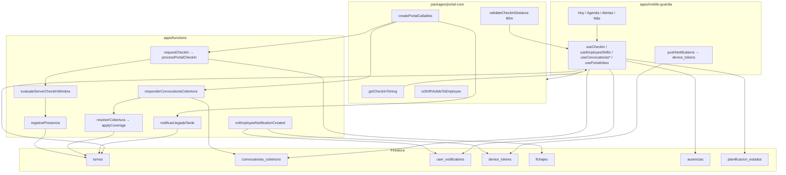

# PROMPT / CONTEXTO CANÓNICO — Portal / App Guardia (COSP)

> **Uso:** Pegá este documento al inicio de un chat cuando trabajes portal, fichada GPS, convocatorias del vigilador, push o hosting `/app`.
> **Proyecto:** COSP V1.0 / CronoApp — `C:\APP\cronoapp` (GitHub `adminbacarsa/BSP`).
> **Fuente:** `apps/mobile-guardia`, `packages/portal-core`, `apps/functions/src/fichajes/*`, `coverage/convocatoriasCobertura.ts`, `docs/MOBILE-GUARDIA-IMPLEMENTACION.md`, `CLAUDE.md`.
> **Idioma:** español técnico. Si contradice código, **priorizá el código** y señalá la divergencia.

---

## Instrucciones para el asistente

1. Un solo canal de producto para el vigilador: **Expo en `apps/mobile-guardia`** (SPA `/app` + APK Android + PWA iPhone). No reabrir portal Next `/empleado/*` (solo redirect).
2. Lógica compartida en **`packages/portal-core`**; callables con nombres de `PORTAL_CALLABLES`.
3. Fichada: UI = `getCheckInTiming`; autoridad = `evaluateServerCheckInWindow` → `registrarPresencia`.
4. Cobertura: el guardia responde con `responderConvocatoriaCobertura`; materializa `applyCoverage` (no inventar `ops_cov_*`).
5. Soft-delete usuarios/clientes; no inventar `CONVOKED_FLEX` (no existe en código; ver backlog).
6. Antes de cambiar: identificar **flujo(s)**, **colecciones** e **impacto Ops**.

---

## 1. Resumen ejecutivo

El **Portal/App Guardia** («COSP Guardia») es el canal del vigilador: turnos, fichada GPS, llegada tarde / ¿Venís?, aceptar/rechazar coberturas, novedades/licencias, permutas, eventos EV, credencial y alertas push.

| Capa | Ubicación | Rol |
|------|-----------|-----|
| UI | `apps/mobile-guardia` | Expo Router + RN; tabs Hoy / Agenda / Alertas / Más |
| Core | `packages/portal-core` (+ `portal-types`) | Timing, visibilidad turnos, callables, geo 80 m, ausencias |
| Backend | `apps/functions` | `requestCheckIn`, ventanas server, cobertura, FCM |
| Hosting | `https://comtroldata.web.app/app` | `build:web` → `dist-web` → `build/hosting/app` |
| Plan largo | `docs/MOBILE-GUARDIA-IMPLEMENTACION.md` | Fases F0–F7, checklist SA, paridad web↔Android |

**Tres superficies, un código:** SPA web `/app`, APK Android (OTA EAS), PWA Safari iPhone (sin App Store v1). Legacy `/empleado/*` → `EmpleadoAppRedirect` → `/app`.

---

## 2. Arquitectura (grafo)



**Cadena fichada:** `useCheckIn` → GPS → `requestCheckIn` → `processPortalCheckIn` → `evaluateServerCheckInWindow(source: PORTAL_GPS)` → doc `fichajes/{idempotencyKey}` → `registrarPresencia` → `turnos.isPresent=true`, `status: PRESENT`, `checkInMethod: PORTAL_GPS`.

**Ops/VIGI:** callable `registrarPresencia` **salta** ventana estricta (`OPERATIONS` / `VIGI` / `DEMO` / `MANUAL_*` → `allowed: true`).

---

## 3. Ventanas de fichada

| Caso | UI `getCheckInTiming` | Server `evaluateServerCheckInWindow` |
|------|----------------------|--------------------------------------|
| Normal a tiempo | **T−15 … T+5** botón **Presente** | Igual |
| Sin aviso, llegada tarde | **T+5 … T+30** botón **Llegada tarde** («Llegás N min tarde; queda registrado.»). Flag `lateNoNotice` | Igual; `registrarPresencia` crea novedad `LLEGADA_TARDE` (minutos). **T+31** → `TOO_LATE` |
| Aviso tarde | Hasta **min(inicio+eta, T+60)**; sin eta → **T+30**. El botón sigue **Presente** | Prioriza `lateArrivalEtaAt`; si no, confirmed → T+30. Sin `lateNoNotice` |
| Aviso «Voy tarde» | `canNotifyLate`: **T−60 … T+5** | Callable `notificarLlegadaTarde` |
| `OPERATIONS_COVERAGE` (no registro) | inicio−15 … max(createdAt, inicio)+60 | Igual espíritu |
| ADV (`isEarlyStart`) | Ventana adelanto **OR** propia | Igual |
| `coverageHoursOnSource` | No fichable | `TRACE_REGISTRATION` |
| Ausente / franco (no FT) | No | `ABSENT` / vacío |
| Lab `relaxWindow` | ±240 min | Solo cliente |

**GPS:** radio **80 m** (`CHECK_IN_MAX_DISTANCE_KM = 0.08`); sin coords objetivo o `allowRemoteCheckIn` → OK.

**`CONVOKED_FLEX`:** **no hay símbolo en el repo**. Ventana convocado vigente = `OPERATIONS_COVERAGE` arriba. Backlog CLAUDE: alinear UI↔server + legacy si aplica.

---

## 4. Flujos (1–12)

### Flujo 1 — Activación dispositivo
Mail con token → `/app/activar` → `activateAndSetPassword` → deviceId + Auth → login. Un device por legajo.

### Flujo 2 — Login + gate device
Credenciales → `PortalAuthContext` / `deviceVerified`. Otro device → `/device-blocked` (+ registro pendiente Plataforma).

### Flujo 3 — Ver turnos (Hoy / Agenda)
`useEmployeeShifts`: `turnos` + `ausencias` + `planificacion_estados`. Filtro `isShiftVisibleToEmployee`: oculta draft, ausente-like, `coverageHoursOnSource`; operativos (`RETEN`, `OPERATIONS_COVERAGE`, `EVENTO`/`EV`, `resolvedBy=OPERACIONES`) siempre; planificados solo con mes publicado.

### Flujo 4 — Fichar presente
UI `getCheckInTiming` + GPS 80 m → `requestCheckIn` → `registrarPresencia`. Efecto: `isPresent`, `PRESENT`, `checkInAt` (hora real), cancela ¿Venís?, relevo FIFO, novedad `INGRESO_AUTOREGISTRO`, notif `CHECKIN_CONFIRMADO`. Pago: `realStartTime` = inicio planificado si fichó hasta T+5; desde T+6 la hora real y `lateMinutes`. La tarjeta muestra «Ingresó HH:MM (N min tarde)» con `checkInAt`. Entre T+5 y T+30 **sin aviso** el botón es **Llegada tarde** y además se escribe novedad `LLEGADA_TARDE` con los minutos (`lateNoNotice`). Con aviso previo la ventana sigue la ETA (tope T+60) y el botón queda **Presente**. Aviso push: T−5 «¿estás llegando?» y ¿Venís? en el minuto de T (`scheduledArrivalNotices`, canal Android `alertas_turno`).

### Flujo 5 — Cola offline
Sin red: `pending_checkins` (AsyncStorage / web storage) → flush al reconectar con idempotencyKey.

### Flujo 6 — Voy a llegar tarde
T−60…T+5 → `notificarLlegadaTarde({ shiftId, etaMinutes })` → `lateArrivalAt` / eta; novedad `LLEGADA_TARDE_AVISO` a Ops; extiende ventana fichada.

### Flujo 7 — ¿Venís? (`LLEGADA_TARDE`)
Doc `convocatorias_cobertura` → **Sí** (eta 15/30/60) / **No** → No = `markShiftAbsent` → cascada cobertura.

### Flujo 8 — Aceptar cobertura (**canal operativo = Hoy**)
Push + **`CoberturaConvocatoriasBanner` en tab Hoy** → `responderConvocatoriaCobertura(ACCEPTED)` → `resolverCobertura` / `applyCoverage` → `ops_cov_{titular}_{emp}` `origin: OPERATIONS_COVERAGE`. Timeout convocatoria **3 min**. Claim atómico 2 min.

Tres banners en Hoy: `CoberturaConvocatoriasBanner` (cobertura Ops), `LlegadaTardeVenisBanner` (¿Venís?), `ConvocatoriasBanner` (eventos EV — distinto).

### Flujo 9 — Rechazar cobertura
`REJECTED` → novedad + `avanzarCascada` / vacante.

### Flujo 10 — Novedad / licencia
`/novedad` → `ausencias` (+ Storage certificado). Clasificación `classifyAbsenceForEmployee`. Banner AA pendiente en Hoy.

### Flujo 11 — Alertas / push
Escritura `user_notifications` (cobertura, check-in, swap, retención, EV…). Trigger `onEmployeeNotificationCreated` → FCM vía `device_tokens`. Lectura: `usePortalInbox` + deep link `/app/?notif=…`.

**GAP crítico — tab Alertas:** Aceptar/Rechazar cobertura desde `alertas.tsx` hace **soft-dismiss** de `user_notifications` (`usePortalInbox.respond`) y **no** llama `responderConvocatoriaCobertura` → **no aplica cobertura**. La respuesta operativa válida es **Hoy → CoberturaConvocatoriasBanner**.

### Flujo 12 — Retención
Ops marca `isRetention`: Hoy «esperá al relevo»; hero no desaparece tras `endTime`; Agenda etiqueta Retenido.

---

## 5. Diferencias web / app / PWA

| Aspecto | Legacy `/empleado` | SPA `/app` | APK Android | PWA iPhone |
|---------|--------------------|------------|-------------|------------|
| Código | Redirect only | `mobile-guardia` | Mismo | Mismo |
| Entrada | → `/app` | `comtroldata.web.app/app` | Play / APK | Safari + A2HS |
| Timing | Legacy simple (retirado) | `portal-core` | Idem | Idem |
| deviceId | — | LS + IndexedDB | SecureStore | LS + IDB |
| Push | — | FCM web VAPID | FCM nativo | Limitado; mejor instalada |
| Updates | — | Redeploy hosting | OTA EAS | Redeploy |
| Alertas UI | — | `appAlert` (no `Alert.alert`) | `appAlert`/nativo | `appAlert` |
| Store iOS | — | — | — | Sin IPA v1 |

Deploy web: `scripts/sync-guard-web-hosting.js` (inyecta VAPID desde web2). `firebase.json`: rewrite `/app/**` → `/app/index.html`. Links server: `EMPLOYEE_PORTAL_HOME = '/app/'`.

---

## 6. Archivos clave

```
packages/portal-core/src/
  checkIn/portalCheckIn.ts          # getCheckInTiming, GPS, cola key
  checkIn/checkInUiStatus.ts
  shifts/employeeShiftVisibility.ts # isShiftVisibleToEmployee
  shifts/isAbsentLikeShift.ts
  absences/employeeAbsence.ts
  callables/{names,index}.ts        # PORTAL_CALLABLES
  notifications/inboxNormalize.ts
  geo/haversine.ts                  # 80 m

apps/mobile-guardia/
  app/(tabs)/{index,agenda,alertas,mas}.tsx
  app/{login,activar,novedad,eventos,permutas,credencial,device-blocked}.tsx
  src/hooks/{useCheckIn,useEmployeeShifts,useConvocatoriasCobertura,usePortalInbox,…}
  src/lib/{pushNotifications,pendingCheckins,appAlert,notificationNavigation}

apps/functions/src/
  fichajes/{checkInWindow,applyPortalCheckIn,registrarPresencia}.ts
  coverage/convocatoriasCobertura.ts  # responderConvocatoriaCobertura
  notifications/onEmployeeNotificationCreated.ts
  index.ts                            # requestCheckIn, notificarLlegadaTarde, …

apps/web2/src/components/empleado/EmpleadoAppRedirect.tsx
apps/web2/src/lib/employeeAppPaths.ts
scripts/sync-guard-web-hosting.js
firebase.json
docs/MOBILE-GUARDIA-IMPLEMENTACION.md
```

**Callables portal:** `activateDevice`, `activateAndSetPassword`, `requestCheckIn`, `reportarAusencia`, `notificarLlegadaTarde`, `responderConvocatoriaCobertura`, swaps (`getSwap*`, `create/respond/confirm/cancelSwapRequest`), `deleteMyTokens`, `sendTestNotification`, `respondEventoConvocatoria`.

**Colecciones:** `turnos`, `fichajes`, `convocatorias_cobertura`, `user_notifications`, `device_tokens`, `ausencias`, `planificacion_estados`, `novedades`, `empleados`, `solicitudes_evento`.

---

## 7. Impacto en Ops

| Acción guardia | Efecto Ops / turno |
|----------------|-------------------|
| Fichada OK | `isPresent` / `PRESENT` / `PORTAL_GPS`; cierra ¿Venís?; relevo FIFO; novedad ingreso |
| Aviso tarde | `lateArrival*`; novedad `LLEGADA_TARDE_AVISO`; retiene saliente con aviso |
| ¿Venís? No | `markShiftAbsent` → cascada (si !Manual) |
| Acepta cobertura | `applyCoverage` → `ops_cov_*`; titular cubierto / ausente-like |
| Rechaza | Cascada siguiente / `VACANTE_*` |
| EXT/ADV registro | Oculto en portal (`coverageHoursOnSource`); horas en turno propio |
| Retenido | Sigue visible en Hoy tras `endTime` |

Ops marca presente **sin** ventana T−15 vía `registrarPresencia` (canal OPERATIONS). Protocolo CC: ver `docs/PROMPT-COBERTURA-CC-FLUJOS.md`.

---

## 8. Backlog — `getCheckInTiming` / alineación

**CLAUDE.md (abierto):**
> Fichaje convocado (portal UI): alinear `portal-core` `getCheckInTiming` con ventanas servidor; **`CONVOKED_FLEX` legacy si aplica.**

| Hallazgo | Detalle |
|----------|---------|
| Sin `CONVOKED_FLEX` | No hay símbolo en `packages/` ni `mobile-guardia`; no implementar el nombre a ciegas |
| Casi alineado | Normal / ops_cov / ADV / TRACE ya espejados en espíritu |
| Desvío fino | Cliente: `etaMinutes` / `lateArrivalEtaMinutes`; server: prioriza **`lateArrivalEtaAt`** |
| Fin turno | Server: `SHIFT_ENDED` si `now > end`; UI no siempre rechaza igual |
| Lab `relaxWindow` | ±4 h solo cliente; no existe en servidor |
| GPS | Radio **80 m** solo cliente; server no revalida GPS |
| Alertas ≠ callable | Soft-dismiss inbox no materializa cobertura (ver Flujo 8/11) |
| Tests | Vitest `portalCheckIn.timing.test.ts` (~16 casos) = contrato UI |
| Doc mobile | F2-08 refactor residual, F2-09 GPS real, F6-01 Play Internal, F0-11 privacidad, F7 Play; iOS nativo descartado v1 |

**Al tocar timing:** cambiar **ambos** (`portalCheckIn.ts` + `checkInWindow.ts`) + tests; no solo UI.

---

## 9. Reglas críticas (checklist)

1. Producto = `mobile-guardia` + `portal-core`; `/empleado` solo redirect.
2. Autoridad de fichada = servidor (`evaluateServerCheckInWindow`).
3. Radio GPS 80 m salvo sin coords / remote.
4. No fichar `coverageHoursOnSource` (TRACE).
5. Cobertura: `responderConvocatoriaCobertura` → `applyCoverage` (ID `ops_cov_*`).
6. Push: escribir `user_notifications`; FCM vía `onEmployeeNotificationCreated` + `device_tokens`.
7. Web alerts: `appAlert`, no `Alert.alert`.
8. Deploy `/app`: sync-guard-web-hosting + VAPID; Android OTA aparte.
9. No inventar `CONVOKED_FLEX` sin evidencia en código legacy.
10. Priorizar código sobre este prompt si diverge.

---

## 10. Prompt corto de arranque (copiar/pegar)

```
Leé docs/PROMPT-PORTAL-APP-GUARDIA.md. Es el mapa canónico del Portal/App Guardia COSP:
mobile-guardia + portal-core, requestCheckIn/applyPortalCheckIn/checkInWindow,
getCheckInTiming, responderConvocatoriaCobertura, user_notifications, hosting /app.

Tarea: [DESCRIBÍ AQUÍ LO QUE NECESITÁS]

Restricciones:
- No reabrir portal Next /empleado como producto.
- Timing: espejar UI y servidor; no inventar CONVOKED_FLEX.
- Cobertura: applyCoverage único; timeout 3 min.
- Soft-delete usuarios/clientes.
```

**Doc de plan / checklist dispositivo:** `docs/MOBILE-GUARDIA-IMPLEMENTACION.md`  
**Cobertura CC (Ops):** `docs/PROMPT-COBERTURA-CC-FLUJOS.md`
