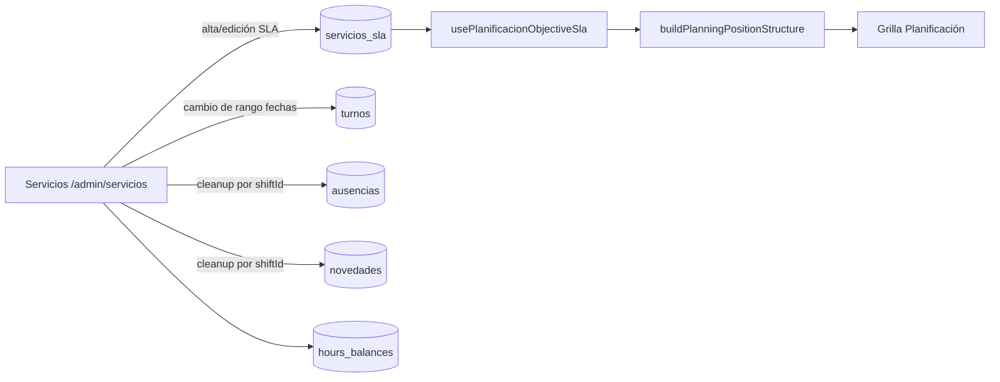
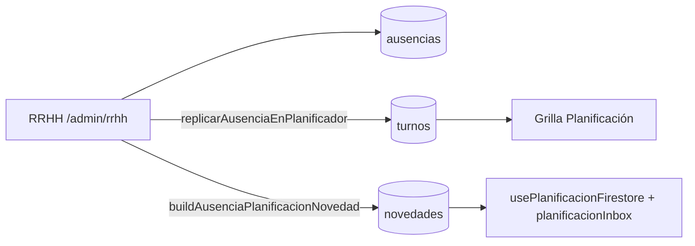
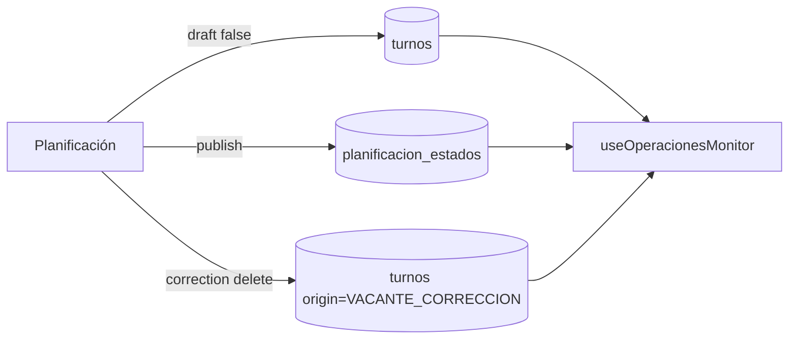
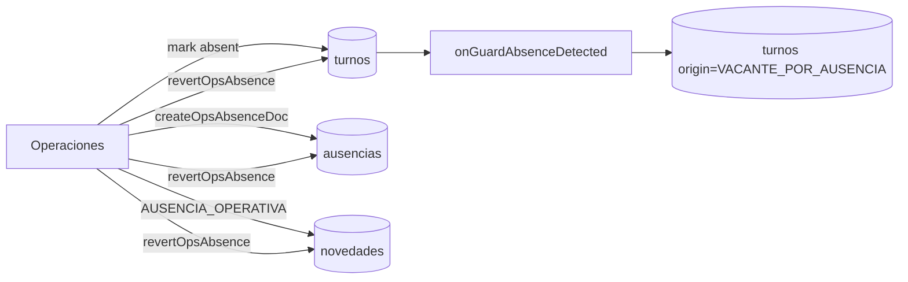
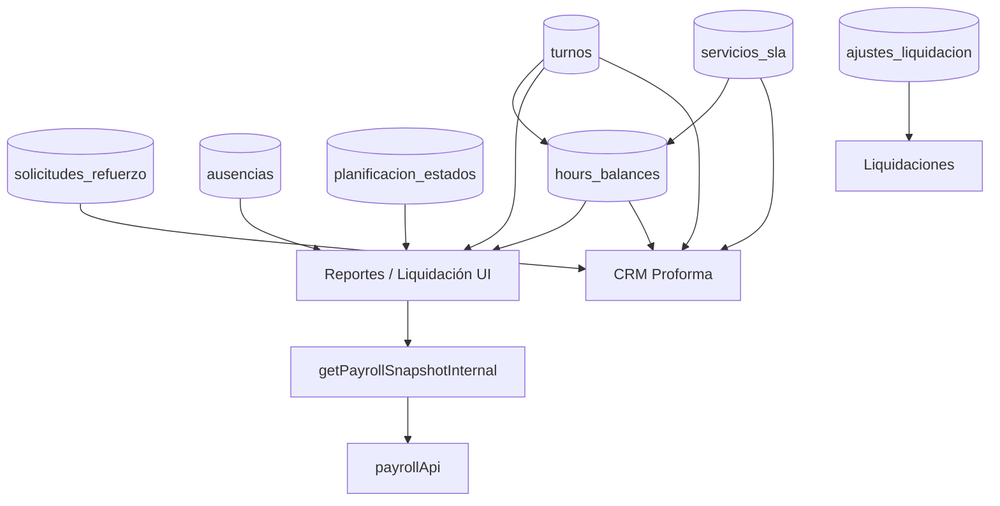
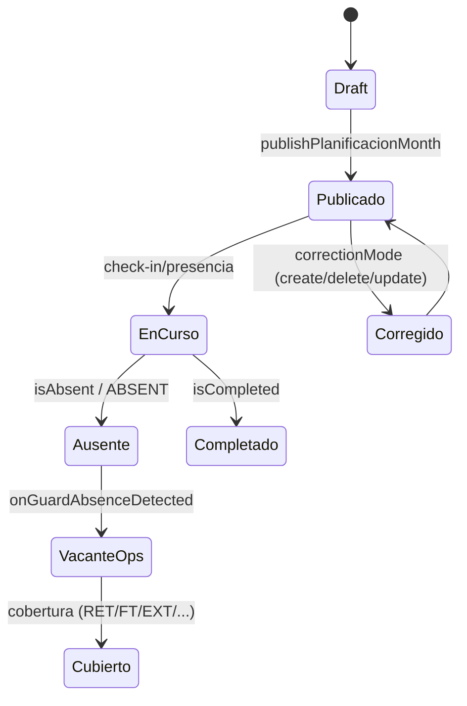

# Arquitectura de los flujos de negocio

## 1. Resumen ejecutivo

Este análisis mapea, con evidencia de código, los “cables” entre **Servicios, Planificación, Operaciones, RRHH y Prefactura/Liquidación** en COSP/Cronoapp.  
La arquitectura actual funciona sobre un núcleo común (`turnos`, `ausencias`, `novedades`, `servicios_sla`) con fuerte composición en cliente (hooks + joins en memoria) y procesos servidor (triggers/callables/API payroll).

Conclusiones ejecutivas:

1. **`turnos` es la entidad eje transversal**, pero su semántica cambia según módulo (planificado, operativo, novedad, vacante, cobertura), y hay reglas duplicadas para interpretar estado.
2. **La publicación de cronograma (`planificacion_estados.publishedAt`) es pivote** para visibilidad y liquidación, pero convive con excepciones operativas y fallbacks legacy.
3. **Prefactura/Liquidación tiene múltiples vistas de verdad**: CRM Proforma, Reportes, `hours_balances`, `ajustes_liquidacion`, y `payroll_cycles_locks` no siempre convergen al mismo “corte”.
4. **Existe deuda de canonicidad de IDs** (cliente/objetivo) y de tenancy (`empresaId` + legado Bacarsa) que obliga a alias/fallbacks.
5. **Hay oportunidades P0 de alto retorno**: contrato único de estados de turno, snapshot versionado de cierre, y unificación de reglas críticas (operativo/publicado/liquidable).

---

## 2. Mapa de módulos y fuentes de verdad

### 2.1 Matriz de módulos (rutas, lógica, datos, permisos)

| Módulo | Rutas / pantallas | Hooks / servicios clave | Functions / backend clave | Colecciones / docs clave | Permisos y control |
|---|---|---|---|---|---|
| Servicios | `/admin/servicios` | `slaService`, `solicitudRefuerzoService`, `patchSlaHoursOnBalances` | Triggers de notificación sobre turnos/novedades consumen sus efectos indirectamente | `servicios_sla`, `turnos`, `ausencias`, `novedades`, `hours_balances` | `canReadModule('SERVICES')`; reglas tenant sobre `servicios_sla` |
| Planificación | `/admin/planificacion` | `usePlanificacionFirestore`, `usePlanificacionObjectiveSla`, `executePlanificacionSaveJob`, `publish/unpublish` | `runAutoSchedule`, `optimizePlanningGemini` (callables), triggers sobre turnos/publicación | `turnos`, `planificacion_estados`, `novedades`, `ausencias`, `audit_logs` | `PLANNING` + acciones `publish/correct/auto_lab/assign_ft` |
| Operaciones | `/admin/operaciones` | `useOperacionesMonitor`, `registrarPresenciaOps`, `coverageLedger`, `revertOpsAbsence` | `onGuardAbsenceDetected`, `onTurnoWrite`, `crearConvocatoriaCobertura`, crons CC | `turnos`, `ausencias`, `novedades`, `convocatorias_cobertura`, `user_notifications` | `OPERATIONS` + reglas tenant en turnos/ausencias/novedades |
| RRHH | `/admin/rrhh` | `employeeService`, `absenceService`, `novedadTypeService`, réplica a planificador | Callables/triggers consumen `ausencias` y `turnos` para notificaciones/liquidación | `empleados`, `ausencias`, `tipos_novedad`, `turnos`, `novedades`, `audit_logs` | `RRHH` (+ `adjust`), reglas tenant y ownership empleado |
| Prefactura / Reportes / Liquidaciones | `/admin/crm` (PREFACTURA), `/admin/reportes`, `/admin/liquidaciones` | `proformaGrid`, `useReportes`, `useLiquidaciones`, `hoursBalance` | `getPayrollSnapshotInternal`, `payrollApi`, `create/revokePayrollApiKey` | `turnos`, `servicios_sla`, `hours_balances`, `ajustes_liquidacion`, `payroll_settings`, `payroll_cycles_locks`, `integraciones_api` | `REPORTS`/`API_KEYS`, reglas explícitas para `hours_balances`, `ajustes_liquidacion`, `integraciones_api` |

### 2.2 Fuentes de verdad por dominio

| Dominio | Fuente primaria observada | Fuentes derivadas / secundarias | Observación de arquitectura |
|---|---|---|---|
| SLA contratado | `servicios_sla` | `hours_balances.slaHours`, cálculos en CRM/Reportes | Múltiples consumidores recalculan SLA por período |
| Turno planificado/operativo | `turnos` | `planificacion_estados` (publicado), `novedades`, `coverageLedger` embebido en turnos | `turnos` mezcla estados y roles distintos |
| Ausencias | `ausencias` + flags en `turnos` (`isAbsent`, `absenceId`) | `turnos` tipo `NOVEDAD` replicados por RRHH, `novedades` | Doble representación (documento + réplica de turnos) |
| Coberturas / vacantes | `turnos` (`origin`, `isUnassigned`, `status`) | `convocatorias_cobertura`, `novedades`, campos ledger | Conciliación depende de convenciones de campos |
| Horas prefactura | CRM Proforma sobre `turnos` + `solicitudes_refuerzo` + SLA | `hours_balances` y reportes mensuales | Base de cálculo cambia por modo (`planned/executed/sin_cobertura`) |
| Horas liquidables | `buildLiquidacionSnapshot` (functions) | `useReportes` (UI), `ajustes_liquidacion`, `payroll_cycles_locks` | Fórmulas espejo en cliente/servidor |
| Cierre de ciclo | `payroll_cycles_locks/{cycleId}` + snapshot incluido | `payrollLockedAt` sellado en docs | El snapshot convive con recálculo live |

---

## 3. Flujos end-to-end (incluye diagramas Mermaid legibles)

### 3.1 Servicios → Planificación

**Flujo funcional verificado**
- Servicios define/edita SLA en `servicios_sla`.
- Planificación carga SLA por contexto cliente/objetivo/mes y construye estructura (`puestos`, `turnos`, `coverageType`) con fallback si falta configuración.
- Cambios en Servicios pueden:
  - re-etiquetar puestos sobre `turnos`,
  - borrar turnos/ausencias/novedades fuera de nuevo rango de fechas,
  - parchear `hours_balances`.

**Contrato de datos principal**
- `servicios_sla`: `clientId`, `objectiveId`, `positions[]`, `startDate/endDate`, `coverageType`, `shifts[]`, `totalMonthlyHours`, `empresaId`.

---

### 3.2 RRHH → Planificación

**Flujo funcional verificado**
- RRHH crea/edita ausencia en `ausencias`.
- Si replica a planificación:
  - marca turnos originales (`isAbsent`, `absenceId`, `hasNovedad`),
  - crea turnos `type='NOVEDAD'` por día,
  - emite novedad para bandeja de Planificación (`source='AUSENCIA'`, `actionTarget='PLANIFICACION'`).
- Si se rechaza/elimina ausencia, limpia réplicas por `absenceId`.

**Contrato de datos principal**
- `ausencias`: `employeeId`, `type`, `status`, `startDate/endDate`, `absenceType`, `objectiveId?`, `clientId?`, `empresaId`.
- réplica en `turnos` (NOVEDAD): `absenceId`, `code`, `plannedNovedad`, `hours`, `startTime/endTime`.

---

### 3.3 Planificación → Operaciones

**Flujo funcional verificado**
- Publicar cronograma:
  - setea `planificacion_estados.publishedAt`,
  - pasa `turnos.draft=true -> false`.
- Operaciones consume `turnos` + `planificacion_estados`:
  - muestra planificados sólo si publicado,
  - siempre incluye operativos (`RETEN`, `OPERATIONS_COVERAGE`, `SLA_VIRTUAL`, `resolvedBy='OPERACIONES'`).
- En corrección, eliminar un turno puede crear `VACANTE_CORRECCION` con `actionTarget` a Ops/Planificación según timing.

**Contrato de datos principal**
- `planificacion_estados`: docId tenant-aware o legacy, `objectiveId`, `year/month`, `publishedAt`, `defaultPositionByEmp`, `defaultShiftByEmp`, `empresaId`.
- `turnos`: `draft`, `origin`, `status`, `isReportedToPlanning`, `actionTarget`.

---

### 3.4 Operaciones → RRHH

**Flujo funcional verificado**
- Operaciones marca ausencia:
  - crea/usa doc en `ausencias`,
  - actualiza turno titular (`isAbsent`, `absenceId`, `absenceType`, `status='ABSENT'`),
  - crea novedad `AUSENCIA_OPERATIVA` para RRHH/Planificación.
- Trigger `onGuardAbsenceDetected` crea `VACANTE_POR_AUSENCIA` deduplicada para cobertura.
- Reversión de ausencia limpia vacantes, ausencias y novedades relacionadas.

**Contrato de datos principal**
- `turnos`: `isAbsent`, `absenceId`, `absenceType`, `absenceConfirmedBy/At`.
- `novedades`: `type='AUSENCIA_OPERATIVA'`, `employeeId`, `shiftId`, `absenceId`, `reportedBy='OPERACIONES'`.

---

### 3.5 Planificación/Operaciones/RRHH/Servicios → Prefactura

**Flujo funcional verificado**
- **Servicios** aporta SLA y estructura vendida.
- **Planificación** aporta horas planificadas y publicación.
- **Operaciones** aporta cobertura real, vacantes, fichadas, novedades operativas.
- **RRHH** aporta ausencias/justificaciones.
- **Prefactura/Reportes** consolida en:
  - CRM Proforma (planned/executed/sin_cobertura + RFZ/TURA),
  - `hours_balances` (SLA/plan/real/resultante),
  - liquidación (snapshot calculado + ajustes + cierre API).

**Contrato de datos principal**
- Proforma combina `turnos` elegibles por modo + `solicitudes_refuerzo` facturables + SLA vigente.
- Liquidación API/UI consume `buildLiquidacionSnapshot` con `hoursMode` (`payroll_settings`), y cierre crea `payroll_cycles_locks`.

---

## 4. Contratos de datos y estados

### 4.1 Contratos críticos observados

1. **Turno (`turnos`)**
   - Identidad operativa: `id`, `employeeId`, `objectiveId`, `startTime/endTime`, `empresaId`.
   - Estado/flujo: `draft`, `status`, `isCompleted`, `isAbsent`, `isReportedToPlanning`.
   - Origen/semántica: `origin`, `resolvedBy`, `isUnassigned`, `vacancyOrigin`.
   - Cobertura ledger embebido: `coverageEventId`, `coversEmployeeId`, `coveredByEmployeeId`, `causedByShiftId`.

2. **Publicación (`planificacion_estados`)**
   - Key dual: `${empresaId}_${objectiveId}_${year}_${month}` y legacy `${objectiveId}_${year}_${month}`.
   - Publicación: `publishedAt/publishedBy`.
   - Estado de malla: `defaultPositionByEmp`, `defaultShiftByEmp`, trailing.

3. **Ausencia (`ausencias`)**
   - RRHH: `type`, `status`, `hasCertificate`, `startDate/endDate`.
   - Enlace turno: `shiftId?`, `employeeId`, `absenceType`.

4. **SLA (`servicios_sla`)**
   - Venta base: `totalMonthlyHours`.
   - Estructura: `positions[]`, `coverageType`, `shifts[]`, exclusiones.

5. **Extracto mensual (`hours_balances`)**
   - `slaHours`, `plannedHours`, `realHours`, `vacantHours`, `resultante`, `saldoPlan`, `saldoReal`.
   - DocId: `{empresaId}_{objectiveId}_{yyyy-mm}`.

6. **Cierre de liquidación (`payroll_cycles_locks`)**
   - `cycleId`, `lockedAt`, `lockedBy`, `snapshot`.
   - Sellos en docs: `turnos/ausencias.payrollLockedAt/payrollCycleId`.

### 4.2 Modelo actual de estados de turno (implícito)

**Observación**: el estado no está modelado como enum canónico único; se distribuye entre `status` + flags + `origin`.

### 4.3 Duplicaciones de contrato relevantes

- Predicado “turno operativo” duplicado en múltiples archivos front y functions.
- Fórmulas de liquidación duplicadas (UI reportes ↔ `payroll-api/calc`).
- Identidad de objetivo resuelta por alias/fallback (`objectiveId` vs `objectiveName` + `clientId`).

---

## 5. Hallazgos por integración

### 5.1 Servicios → Planificación

1. **Integración fuerte y directa por colección compartida**: Planificación consume `servicios_sla` para estructura mensual y fallback de contrato.
2. **Side-effects agresivos al editar rango SLA**: se eliminan `turnos`, `ausencias`, `novedades` fuera de rango en bloque.
3. **Sin evento de dominio explícito** para “SLA cambiado”; se usan mutaciones directas + auditoría textual.

### 5.2 RRHH → Planificación

4. **Réplica materializada en `turnos` tipo NOVEDAD** además de `ausencias` (doble representación).
5. **Notificación a Planificación bien definida** (`buildAusenciaPlanificacionNovedad`) pero su entrega depende de writes desde cliente.
6. **Limpieza por `absenceId` elimina réplicas**, correcto funcionalmente pero sin versionado de historial de malla.

### 5.3 Planificación → Operaciones

7. **`publishedAt` gobierna visibilidad de planificados**, con bypass para operativos.
8. **Correcciones generan vacantes operativas** (`VACANTE_CORRECCION`) con enrutamiento temporal (Planificación/Ops).
9. **Convivencia de docId tenant + legacy en `planificacion_estados`** incrementa complejidad de lookup.

### 5.4 Operaciones → RRHH

10. **Ausencia operativa dispara cadena completa** (`turnos` + `ausencias` + `novedades` + trigger de vacante).
11. **Deduplicación parcial buena** (`vacancyCreatedForAbsence` + query de duplicados), pero el proceso es eventual.
12. **Lógica de cobertura y autoacciones parcialmente en cliente** (`useOperacionesMonitor` crea docs auto), elevando riesgo de carreras según sesión.

### 5.5 Módulos → Prefactura

13. **Proforma combina varias capas y modos de cálculo** (`planned`, `executed`, `sin_cobertura`) con enriquecimiento por alias de objetivo.
14. **`hours_balances` se recalcula desde varios puntos** (Servicios, Planificación, CRM bootstrap/live), con posible desfase temporal.
15. **Liquidación interna y API recalculan live aunque exista lock**; `lockedAt` se informa pero no se reutiliza snapshot lockeado en lectura normal.

### 5.6 Matriz de conexiones (productor/consumidor/riesgo/recomendación)

| Conexión | Productor | Consumidor | Colección / API | Dato intercambiado | Fuente de verdad actual | Riesgo actual | Recomendación |
|---|---|---|---|---|---|---|---|
| Servicios → Planificación | `/admin/servicios` | `usePlanificacionObjectiveSla` | `servicios_sla` | puestos, bandas, vigencia, horas SLA | `servicios_sla` | fallback estructural oculta incompletitud de SLA | validar contrato obligatorio por objetivo/mes antes de publicar |
| Servicios → Prefactura | Servicios + CRM | CRM Proforma / Reportes | `servicios_sla`, `hours_balances` | SLA vendidas por objetivo/mes | dual (SLA live + extracto) | divergencia si extracto desfasado | política explícita de precedencia y timestamp de corte |
| RRHH → Planificación | `/admin/rrhh` | Planificación inbox + grilla | `ausencias`, `turnos`, `novedades` | ausencia + réplica turno NOVEDAD | `ausencias` (con réplica en turnos) | doble representación y borrado sin versión | mantener ausencia canónica y proyección derivada versionada |
| Planificación → Operaciones | Planificación publish/save | `useOperacionesMonitor` | `turnos`, `planificacion_estados` | draft/publicado, vacantes corrección | `turnos` + `planificacion_estados` | reglas de elegibilidad repartidas | librería común de elegibilidad (front+functions) |
| Operaciones → RRHH | `/admin/operaciones` + trigger | RRHH + Planificación | `turnos`, `ausencias`, `novedades` | ausencias operativas, vacantes por ausencia | `turnos`/`ausencias` | consistencia eventual multi-write | comando servidor atómico con outbox |
| Operaciones → Planificación | Ops report planning | Planificación inbox | `turnos` (`REPORTED_TO_PLANNING`), `novedades` | vacante sin cubrir | `turnos` | docs auto desde cliente pueden competir | materialización desde function dedicada |
| Operaciones cobertura | Ops + functions cobertura | Operaciones / Notificaciones | `convocatorias_cobertura`, `user_notifications`, `turnos` | cascada CCT, aceptación, cierre vacantes | `convocatorias_cobertura` + `turnos` | idempotencia parcial distribuida | idempotency key por `shiftId+step` persistida |
| Planificación/Servicios → hours_balances | save job, patch SLA, CRM rebuild | CRM/Reportes | `hours_balances` | SLA/plan/real/saldos | `hours_balances` derivado | múltiples escritores | single writer programado + cola de recálculo |
| Reportes/Liquidaciones → Payroll API | UI + API | Sistemas externos | callable + `/v1/payroll/*` | snapshot liquidación, ciclos, cierre | `buildLiquidacionSnapshot` | lock no garantiza lectura congelada | servir snapshot lockeado por defecto si existe |
| Seguridad multiempresa | reglas + helpers | todos | `empresaId` en reglas/helpers | aislamiento tenant | reglas + `multiempresa.ts` | fallback legacy bacarsa + IDs compartidos | plan de migración final de legacy y validaciones estrictas |

---

## 6. Riesgos de consistencia, costo y trazabilidad

### 6.1 Consistencia temporal/estados

1. **Datos “vivos” post-cierre**: se crea `payroll_cycles_locks` y se sella `payrollLockedAt`, pero lecturas estándar siguen recalculando snapshot live.
2. **Estado de turno implícito y fragmentado**: `status` + flags + `origin` + `draft` sin máquina central única.
3. **Corrección retroactiva con efectos cruzados**: eliminar/cambiar turnos puede generar vacantes y cambios de cobertura sin versionado de “antes/después” de malla.

### 6.2 Costo operativo/técnico

4. **Joins en memoria de alto costo** en CRM/Reportes (turnos + empleados + ausencias + SLA + alias).
5. **Lógica espejo cliente/servidor** en liquidación (mayor costo de mantenimiento y riesgo de drift).
6. **Múltiples escritores de `hours_balances`** con distintas fuentes y timings.

### 6.3 Trazabilidad/auditoría

7. **Auditoría existe pero no bloqueante**: hay catch silenciosos y warnings que permiten continuar sin registrar.
8. **Sin outbox/event sourcing**: propagación por escrituras directas en cliente y triggers reactivos.
9. **Dependencia de naming legacy** (`clients`/`clientes`, objective aliases) para reconciliación.

---

## 7. Oportunidades de mejora P0/P1/P2

### P0 (alto impacto, riesgo alto actual, alcance acotable)

1. **Cierre inmutable real para liquidación/prefactura**
   - Si `payroll_cycles_locks/{cycleId}` existe, `GET liquidacion` y callable interno deben devolver snapshot lockeado por defecto.
   - Impacto: elimina cambios post-cierre y discusiones contables.

2. **Modelo canónico de estado de turno (shared library front+functions)**
   - Unificar predicados: operativo/publicado/elegible/facturable/liquidable.
   - Impacto: reduce divergencias entre módulos críticos.

3. **Single-writer para `hours_balances` con job idempotente**
   - Centralizar recomputación por período/objetivo y registrar `rebuildVersion`.
   - Impacto: coherencia de KPI y prefactura.

### P1 (impacto medio-alto, requiere coordinación)

4. **IDs canónicos de objetivo/cliente + tabla de alias controlada**
   - Eliminar reparación manual por `objectiveName`.
   - Impacto: baja errores de cruce y limpieza de legacy.

5. **Comandos de dominio servidor para acciones cross-módulo**
   - Ej.: `marcarAusenciaOperativa`, `replicarAusenciaRRHH`, `devolverVacantePlanificacion`.
   - Impacto: atomicidad y auditabilidad real.

### P2 (evolución estructural)

6. **Outbox de eventos de dominio**
   - Eventos: `ShiftPublished`, `AbsenceConfirmed`, `CoverageAssigned`, `CycleLocked`.
7. **Observabilidad funcional**
   - Métricas por pipeline (latencia, duplicados evitados, errores silenciosos, drift de horas).
8. **Política de deprecación legacy Bacarsa**
   - Fecha de corte y migración completa de docs sin `empresaId`.

---

## 8. Arquitectura objetivo recomendada

### 8.1 IDs canónicos

- `tenantId` (`empresaId`) obligatorio en todos los agregados de negocio.
- `clientId` y `objectiveId` inmutables y únicos por tenant.
- Tabla `objective_aliases` temporal de migración con owner claro y fecha de expiración.

### 8.2 Modelo de estados del turno (canónico)

Propuesta de state model explícito:
- `PLANNED_DRAFT`
- `PLANNED_PUBLISHED`
- `IN_EXECUTION`
- `ABSENT_CONFIRMED`
- `VACANT_OPEN`
- `VACANT_COVERED`
- `COMPLETED`
- `CANCELLED`
- `LOCKED_FOR_PAYROLL`

Con propiedades separadas:
- **state** (único)
- **origin** (plan/ops/rrhh/system)
- **financialFlags** (FT, feriado, etc.)

### 8.3 Eventos de dominio / outbox

Aplicar patrón outbox en servidor (Firestore collection + worker):
- Comando escribe agregado + evento en misma transacción.
- Consumidores proyectan a `novedades`, `hours_balances`, notificaciones, etc.
- Reintento idempotente por `eventId`.

### 8.4 Snapshot/cierre versionado

- Snapshot versionado por ciclo:
  - `payroll_snapshots/{empresaId}_{cycleId}_{version}`
  - `status: DRAFT | LOCKED | SUPERSEDED`
- `payroll_cycles_locks` referencia snapshot fijo.
- UI/API siempre leen snapshot lockeado para ciclo cerrado, con opción explícita “recalcular en sandbox”.

### 8.5 Reconciliación vendidas-planificadas-ejecutadas-liquidables-facturables

Definir pipeline unificado:
1. `vendidas` (SLA vigente)
2. `planificadas` (malla publicada)
3. `ejecutadas` (fichada válida)
4. `liquidables` (reglas CCT + ausencias + ajustes)
5. `facturables` (reglas comerciales y RFZ/TURA)

Cada etapa con:
- input versionado,
- reglas declarativas,
- output persistido y trazable.

### 8.6 Reglas de idempotencia

- Comandos cross-módulo con `idempotencyKey` obligatoria (ej. `tenant_shift_action_ts`).
- Índices/constraints lógicos:
  - una vacante por `causedByShiftId + origin`,
  - una réplica RRHH por `absenceId + date + employee`.
- Reintentos deben ser upsert y no append ciego.

### 8.7 Observabilidad

- Logging estructurado con `traceId`, `tenantId`, `module`, `command`, `entityId`.
- Métricas SLO:
  - tiempo de propagación entre módulos,
  - ratio de reconciliación horas,
  - eventos descartados por tenant mismatch,
  - auditorías fallidas.

---

## 9. Roadmap por etapas (quick wins, consolidación, evolución)

### Etapa A — Quick wins

1. Lectura lockeada en Payroll API + callable interno.
2. Extraer `isOperationalOriginShift` y `isShiftEligible*` a paquete compartido.
3. Endurecer auditoría: convertir catches silenciosos críticos en cola de retry + alerta.
4. Agregar `calculatedAt`, `sourceVersion` y `writerId` en `hours_balances`.

### Etapa B — Consolidación

5. Implementar comando servidor para ausencia operativa y réplica RRHH.
6. Implementar tabla de alias canónica y migración de `objectiveId`.
7. Unificar contrato de estados y transiciones en backend.

### Etapa C — Evolución

8. Outbox de eventos de dominio.
9. Snapshot versionado de prefactura/liquidación.
10. Dashboard de reconciliación end-to-end y drift detector.

---

## 10. Preguntas abiertas para Mauro

1. ¿El ciclo cerrado debe bloquear **toda** mutación de `turnos/ausencias` del período o solo su impacto en liquidación?
2. ¿Prefactura comercial y liquidación laboral deben compartir exactamente la misma base temporal o mantener cortes distintos?
3. ¿Cuál es la política oficial para documentos legacy sin `empresaId` (fecha límite de remediación)?
4. ¿Se acepta mover auto-materializaciones de vacantes hoy hechas en cliente a commands backend?
5. ¿Se requiere trazabilidad legal de “quién cambió qué” con nivel de detalle por campo (before/after)?

### 10.1 Top 10 hallazgos más importantes (priorizados)

1. **Lock de ciclo no congela lecturas estándar** de liquidación (riesgo contable alto).
2. **Estado de turno no canónico**: semántica distribuida en múltiples flags/campos.
3. **Predicado de turno operativo duplicado** en muchos puntos front/back.
4. **Réplica RRHH en `turnos` + `ausencias`** genera doble fuente funcional.
5. **`hours_balances` con múltiples escritores** y consistencia eventual no controlada.
6. **Tenancy legacy Bacarsa + aliases** todavía condiciona consultas y permisos.
7. **Planificación/Operaciones dependen de `publishedAt` + excepciones**, aumentando complejidad de elegibilidad.
8. **Operaciones ejecuta autoacciones desde cliente** (materialización de docs), potencial de carreras.
9. **Edición de SLA puede borrar datos operativos/rrhh fuera de rango** sin versionado histórico.
10. **Auditoría no siempre garantizada** por catches que degradan silenciosamente.

### 10.2 5 oportunidades de mayor retorno

1. Lock inmutable efectivo (API + callable + UI).
2. Librería única de estados/elegibilidad de turno.
3. Single-writer e idempotencia para `hours_balances`.
4. IDs canónicos objetivo/cliente con eliminación gradual de fallback.
5. Commands de dominio server-side para acciones cross-módulo críticas.

### 10.3 Puntos que no pudieron verificarse en este análisis (limitaciones)

1. **Comportamiento runtime** de crons/triggers bajo carga real (se analizó estático, no ejecución completa end-to-end).
2. **Cobertura de índices Firestore en producción** y su impacto real en fallbacks/capturas de error.
3. **Consistencia histórica de datos** (volumen, calidad, outliers) al no ejecutar auditoría de dataset productivo.
4. **Alineación exacta con rewrites/deploy de hosting** para endpoints externos (no se auditó `firebase.json` en esta tarea).

---

## Anexo A — Evidencia de código utilizada (archivo:línea)

- `apps/web2/src/config/modules.ts:2-13, 17-27`
- `apps/web2/src/context/AuthContext.tsx:17-25, 204-215`
- `apps/web2/src/components/layout/DashboardLayout.tsx:47-50, 358-361, 381, 613-784`
- `firestore.rules:281-304, 365-399, 697-753, 711-727`
- `apps/web2/src/hooks/usePlanificacionFirestore.ts:116-133, 255-269, 306-399`
- `apps/web2/src/hooks/usePlanificacionObjectiveSla.ts:67-120`
- `apps/web2/src/lib/planificacion/planificacionPublish.ts:57-109`
- `apps/web2/src/lib/planificacion/planificacionUnpublish.ts:44-92`
- `apps/web2/src/lib/planificacion/executePlanificacionSaveJob.ts:321-370, 690-725`
- `apps/web2/src/lib/planificacion/planificacionInbox.ts:7-18, 33-76`
- `apps/web2/src/lib/multiempresa.ts:202-235, 665, 970-1030`
- `apps/web2/src/hooks/useOperacionesMonitor.ts:590, 754-768, 809-822, 1530-1660`
- `apps/web2/src/pages/admin/operaciones/index.tsx:4423-4469, 4652-4690`
- `apps/web2/src/lib/operaciones/revertOpsAbsence.ts:52-65, 115`
- `apps/web2/src/lib/operaciones/coverageLedger.ts:3-4, 130-190`
- `apps/web2/src/pages/admin/rrhh/index.tsx:464-546, 1300-1314, 1372-1384, 1414-1424`
- `apps/web2/src/services/absenceService.ts:61-94`
- `apps/web2/src/services/employeeService.ts:31-33, 86-90`
- `apps/web2/src/pages/admin/servicios/index.tsx:1370-1419, 1442-1478`
- `apps/web2/src/services/slaService.ts:335-353`
- `apps/web2/src/pages/admin/crm/index.tsx:900-903, 960-963, 1698-1716, 1905-2036, 2087-2221`
- `apps/web2/src/lib/crm/proformaMode.ts:6-47`
- `apps/web2/src/lib/crm/objectiveIdentity.ts:8-9, 109-135, 188-199`
- `apps/web2/src/lib/refuerzo/refuerzoProforma.ts:17-23, 57-84, 97-100`
- `apps/web2/src/lib/hoursBalance/types.ts:7-33, 41-44`
- `apps/web2/src/lib/hoursBalance/buildHoursBalance.ts:76-166, 240-280`
- `apps/web2/src/lib/reportFirestoreQueries.ts:64-117, 163-177`
- `apps/web2/src/hooks/useReportes.ts:288-323, 1480-1556`
- `apps/web2/src/pages/admin/liquidaciones/index.tsx:697-729, 740`
- `apps/web2/src/hooks/useLiquidaciones.ts:223-226, 278-334`
- `apps/functions/src/index.ts:2871-2954, 3039, 3509, 3915`
- `apps/functions/src/notifications/onTurnoWrite.ts:156-200, 209-297`
- `apps/functions/src/notifications/onGuardAbsenceDetected.ts:38-119`
- `apps/functions/src/notifications/onCronogramaPublished.ts:52-98, 156-173`
- `apps/functions/src/notifications/onNovedadCreated.ts:26-46, 76-87`
- `apps/functions/src/payroll-api/handler.ts:79-99, 101-203`
- `apps/functions/src/payroll-api/calc.ts:2-4, 221-230, 263-280, 290-292, 321-326, 376-380, 585-594`
- `apps/functions/src/payroll-api/auth.ts:6-10, 21, 74-76, 125-126`
- `apps/functions/src/scheduling/runAutoSchedule.ts:297-307, 370-425`
